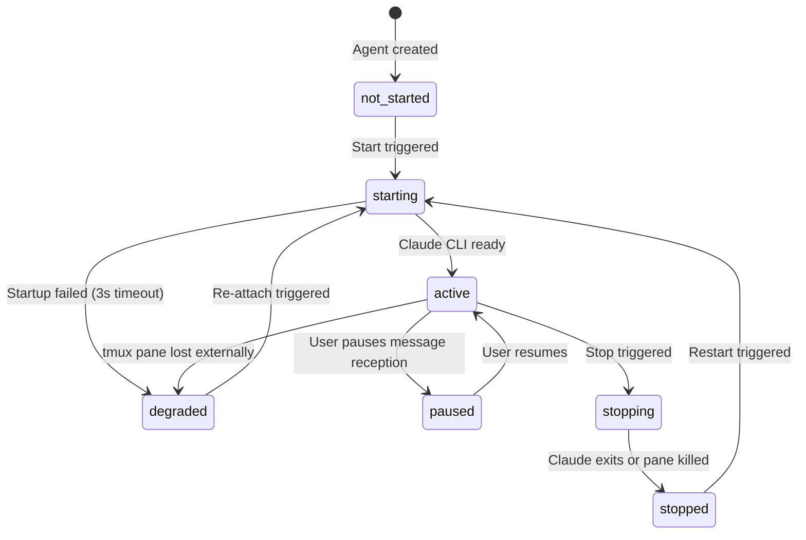

# REQ-001 Agent Management Platform
> Version: v1 | Date: 2026-04-07 | Author: user

## 1. Background

### 1.1 Problem Statement
Developers using AI-assisted workflows often run multiple Claude Code CLI instances simultaneously — a Product Manager agent that produces specifications, a Developer agent that implements them, and a Tester agent that verifies them. Today the human must manually copy output from one agent and paste it into another, acting as the communication relay. This creates a bottleneck, breaks developer flow, and makes multi-agent collaboration impractical at scale.

### 1.2 Solution Overview
The **Agent Management Platform** provides:
- A unified TUI dashboard displaying all agents side-by-side
- A local MCP server (`agent-bus`) enabling agents to publish events via native MCP tool calls
- A supervisor that fans out published events to subscribed agents via `tmux send-keys`
- Session lifecycle management with resume capability via `claude --resume`
- Per-agent system context via `claude --system-prompt`

### 1.3 Target Users
**Primary user**: A single developer on a local macOS workstation who has Claude Code CLI installed and wants to orchestrate 3–10 Claude agents collaborating on a software project.

### 1.4 Core Scenario
The developer opens the platform. Three agents are visible: PM, Developer, Tester. The PM agent finishes writing a spec and calls the MCP tool `publish_event("spec.completed", content)`. The supervisor detects the new event, fans it out to all subscribed agents, and sends it as input to the Developer's tmux pane. The Developer begins implementing. When done, it publishes `code.ready`. The Tester picks it up. The human observes without manually relaying messages.

## 2. Functional Requirements

### 2.1 F-01: Agent Definition and Configuration
Each agent is a named entity with the following configurable properties:
- `name` — string, unique within a group
- `role` — enum: `product_manager`, `developer`, `tester`, `custom`
- `working_dir` — absolute path, must exist at session start
- `system_prompt` — string, passed via `claude --system-prompt` at session start
- `system_prompt_file` — optional file path, passed via `claude --system-prompt-file`
- `topic_subscriptions` — list of topic strings the agent listens to
- `auto_respond` — bool: whether the agent auto-delivers received events or queues them for manual review

#### 2.1.1 Main Flow
1. User opens "New Agent" dialog (keyboard shortcut `N` in Agents panel).
2. User fills in: name, role, working directory, system prompt, topic subscriptions.
3. Platform validates working directory exists.
4. Agent is saved to SQLite and appears in the agent list with status `not_started`.

#### 2.1.2 Error Handling
- Working directory does not exist → inline error, agent not saved.
- Duplicate agent name within a group → inline error.
- System prompt exceeds 10,000 characters → warning shown, save still allowed.

#### 2.1.3 Edge Cases
- Agent's working directory is deleted after creation → mark agent `degraded` at startup, show warning banner.
- Role `custom` → free-text role description prepended as a prefix in the system prompt.

### 2.2 F-02: Group Management
A group is a named collection of agents that share a pub/sub message bus. Agents may belong to multiple groups.

#### 2.2.1 Main Flow
1. User creates a group with a name (keyboard shortcut `N` in Groups panel).
2. User assigns existing agents to the group from a selection list.
3. User saves the group.
4. Group persisted to SQLite; agent membership listed.

#### 2.2.2 Error Handling
- Starting a group with zero agents → blocked, error shown.
- Removing an agent from a group while its session is active → confirmation required; agent session stopped gracefully.

#### 2.2.3 Edge Cases
- An agent is a member of two groups started simultaneously → agent runs two separate Claude sessions in two separate tmux panes, each tracked independently.

### 2.3 F-03: TUI Dashboard Layout
The TUI is a **Textual** application. Layout:

```
+------------------+------------------+------------------+
|  Agent: PM       |  Agent: Dev      |  Agent: Tester   |
|  [role] [status] |  [role] [status] |  [role] [status] |
|  [terminal pane] |  [terminal pane] |  [terminal pane] |
|  [Pause] [Edit]  |  [Pause] [Edit]  |  [Pause] [Edit]  |
+------------------+------------------+------------------+
| Group: sprint-01  [Start] [Stop All] [Resume]           |
| Event Log: pub/sub messages scrolling in real-time      |
+---------------------------------------------------------+
```

#### 2.3.1 Agent Pane Features
- Live output of Claude CLI session via `tmux capture-pane` refresh (≤ 4 Hz).
- Status badge: `active`, `paused`, `stopped`, `degraded`, `not_started`.
- Pending event count badge when `auto_respond=False` or agent is paused.
- `Pause` button / `P` shortcut to pause message reception.
- Clicking pane area or pressing `Enter` on focused pane passes keyboard input directly to the agent's tmux pane.

#### 2.3.2 Main Flow
1. User launches: `python -m agent_management`.
2. TUI loads groups and agents from SQLite.
3. Agent panes render at equal width, vertically scrollable.
4. Event log panel at bottom shows all pub/sub events in real-time.

#### 2.3.3 Error Handling
- tmux session for an agent missing at startup → `[session lost]` shown in pane, "Re-attach" button offered.
- Terminal width < 80 columns → warning banner shown.

#### 2.3.4 Edge Cases
- More than 4 agents in a group → TUI switches to tabbed layout; event log remains persistent.

### 2.4 F-04: Pub/Sub Message Bus (MCP-based)

#### 2.4.1 Architecture
The message bus is implemented as a local **MCP server** (`agent-bus`) started by the platform. All agent Claude sessions are launched with `--mcp-config` pointing to this server. The MCP server stores events in SQLite and exposes tools:

| MCP Tool | Parameters | Description |
|:---|:---|:---|
| `publish_event` | `topic: str, payload: str, metadata?: dict` | Agent publishes a completion event |
| `get_pending_events` | `agent_id: str, topics: list[str]` | Poll for queued events (supervisor use) |
| `pause_agent` | `agent_id: str` | Agent requests to pause its own reception |
| `get_group_status` | `group_id: str` | Query all agents' statuses in a group |

#### 2.4.2 Event Structure

```json
{
  "id": "<uuid>",
  "timestamp": "<ISO8601>",
  "group_id": "<uuid>",
  "source_agent_id": "<uuid>",
  "topic": "spec.completed",
  "payload": "<free text — typically Claude output>",
  "metadata": {}
}
```

#### 2.4.3 Main Flow
1. Agent A's Claude session calls MCP tool `publish_event("spec.completed", payload)`.
2. `agent-bus` MCP server stores the event in SQLite.
3. Supervisor's asyncio polling loop detects the new event.
4. Supervisor fans out to all agents subscribed to `spec.completed` that are not paused.
5. For each recipient with `auto_respond=True`: supervisor calls `tmux send-keys` to inject the message.
6. Message format injected: `[AGENT_MSG from PM | spec.completed]: <payload>`.
7. For recipients with `auto_respond=False`: event buffered in `pending_events` queue; badge updated.

#### 2.4.4 Error Handling
- No subscribers for a topic → warning logged in event log, no error raised.
- Agent queue full (> 100 pending events) → oldest event dropped, warning logged.

#### 2.4.5 Edge Cases
- Source agent is also subscribed to the same topic → event not re-delivered to source (no self-delivery by default; configurable per group).

### 2.5 F-05: Claude Code CLI Session Management
Each agent runs as a Claude CLI interactive session inside a dedicated tmux pane.

#### 2.5.1 Session States


**Figure 2.5.1 — Session state machine**

#### 2.5.2 Start Flow
1. Platform creates (or reuses) named tmux session: `agent-mgmt-<group_id>`.
2. For each agent, creates a tmux pane and runs:
   `cd <working_dir> && claude --session-id <pre-assigned-uuid> --system-prompt "<prompt>" --mcp-config <agent-bus-config> --name "<agent_name>"`
3. If a prior session ID exists for this agent+group, uses `--resume <session_id>` instead.
4. Records the tmux pane ID and Claude session ID in SQLite.

#### 2.5.3 Stop Flow
1. Platform sends graceful interrupt to the tmux pane.
2. Waits up to 5 seconds for Claude to exit cleanly.
3. If not exited: `tmux kill-pane`.
4. Updates session status to `stopped` in SQLite.

#### 2.5.4 Error Handling
- `claude` binary not found → error banner with install instructions.
- tmux not available → critical error, exit with install instructions.
- Claude fails to start within 3 seconds → mark agent `degraded`.

### 2.6 F-06: Session Resume Mechanism

#### 2.6.1 Main Flow
1. User clicks "Resume" for a group.
2. Platform reads `claude_session_id` for each agent from SQLite.
3. Agents with valid session ID: launched with `claude --resume <uuid> --system-prompt "<prompt>" --mcp-config <config>`.
4. Agents with no prior session ID: fresh session started.
5. tmux pane shows Claude resuming from prior conversation context.

#### 2.6.2 Session ID Capture
- Platform pre-assigns a UUID via `--session-id <uuid>` at first start.
- This UUID is stored immediately in SQLite — no polling required.

#### 2.6.3 Error Handling
- Session ID in SQLite no longer exists in `~/.claude/projects/` → "Session expired" warning; offer to start fresh; old session ID moved to `previous_session_id` column.
- `--resume` fails (Claude returns error) → fall back to fresh session.

### 2.7 F-07: One-Click Pause / Stop Message Reception
Each agent can be individually paused from receiving pub/sub messages without stopping its Claude session.

#### 2.7.1 Main Flow
1. User clicks "Pause" on an agent pane (or presses `P` while pane focused).
2. Supervisor sets `agent.paused = True` in SQLite.
3. Incoming events for this agent are buffered in `pending_events` queue (capacity: 50).
4. Agent status badge changes to `paused`.
5. User clicks "Resume" → supervisor drains `pending_events` queue in order, then sets `agent.paused = False`.

#### 2.7.2 Group-Level Stop All
- Pauses all agents in the group simultaneously.
- A single "Resume All" button resumes all.

#### 2.7.3 Error Handling
- Pending queue exceeds 50 events → oldest events dropped, overflow warning in event log.
- User resumes a paused agent whose Claude session has stopped → prompt to restart session first.

#### 2.7.4 Edge Cases
- A paused agent's Claude session can still be interacted with manually by the user clicking into its pane.

### 2.8 F-08: Agent System Context Configuration

#### 2.8.1 Configuration Layers (Priority Order)
1. **Inline system prompt** (`agents.system_prompt` in SQLite) → passed via `--system-prompt`.
2. **System prompt file** (`agents.system_prompt_file` path) → passed via `--system-prompt-file`.
3. **CLAUDE.md** in agent's working directory → auto-discovered by Claude.

#### 2.8.2 Main Flow
1. User opens agent settings (`Ctrl+E` on focused agent pane).
2. TUI shows a multi-line editor widget with the current system prompt.
3. User edits and saves.
4. If agent session is active: banner shown: "Changes will apply on next session start. Restart now? [Y/N]".
5. User presses `Y` → platform stops and restarts the agent's Claude session with the new prompt.

## 3. Non-Functional Requirements

| ID | Category | Requirement |
|:---|:---|:---|
| NF-01 | Performance | TUI pane content refresh ≤ 4 Hz (tmux capture-pane polling) |
| NF-02 | Performance | Pub/sub event delivery < 500ms from publish to recipient queue |
| NF-03 | Reliability | tmux sessions and Claude sessions survive TUI process crash unaffected |
| NF-04 | Reliability | SQLite WAL mode; no data corruption on unexpected shutdown |
| NF-05 | Portability | macOS darwin/arm64 and x86_64; Linux is a stretch goal; Windows out of scope |
| NF-06 | Security | System prompts stored as plaintext in SQLite (local workstation tool; no encryption required) |
| NF-07 | Usability | Full keyboard navigation; no mouse required for any core operation |
| NF-08 | Startup | Platform fully operational within 5 seconds of launch (excluding Claude session resume time) |
| NF-09 | Scalability | Supports up to 10 agents per group without TUI degradation |
| NF-10 | Install | **`uv`** is the required package manager; startup scripts auto-run `uv sync` if venv missing; primary deps: `textual`, `aiosqlite`, `mcp` |
| NF-11 | CLI Command | All Claude CLI invocations use `claude --dangerously-skip-permissions` (equivalent of local alias `claude_skip`); never use bare `claude` |

## 4. Use Cases

### 4.1 UC-01: Create and Configure an Agent
**Actor**: User
**Precondition**: Platform running; at least one group exists.
1. User navigates to Agents panel, presses `N`.
2. Form dialog: Name, Role, Working Directory, System Prompt, Topic Subscriptions.
3. User fills: name=`PM-Agent`, role=`product_manager`, working_dir=`/path/to/project`, system_prompt=`You are a product manager. Produce detailed specifications in Markdown. When done, call publish_event("spec.completed", <content>).`, subscriptions=`["code.ready","test.failed"]`.
4. User submits.
5. Platform validates working directory.
6. Agent saved; appears in list with status `not_started`.

**Alternate 1a** — invalid directory: step 5 shows inline error; form stays open.

### 4.2 UC-02: Create a Group and Add Agents
**Actor**: User
**Precondition**: At least two agents configured.
1. User navigates to Groups panel, presses `N`.
2. User enters group name: `sprint-01`.
3. User selects agents: PM-Agent, Dev-Agent, Test-Agent.
4. User saves.
5. Group `sprint-01` listed with 3 agents.

### 4.3 UC-03: Start a Group Session (with Resume)
**Actor**: User
**Precondition**: Group `sprint-01` exists with 3 agents; some have prior session IDs.
1. User selects group `sprint-01`, presses `S`.
2. Platform checks for existing session records.
3. PM-Agent: no prior session → fresh start with pre-assigned UUID.
4. Dev-Agent: session ID `abc-123` found → `claude --resume abc-123 --system-prompt "..."`.
5. Test-Agent: session ID found but JSONL missing → warning "Session expired"; starts fresh.
6. Three tmux panes appear; status badges change to `active`.

### 4.4 UC-04: Agent Publishes an Event
**Actor**: Agent (PM-Agent via Claude MCP tool call)
**Precondition**: Group session active; PM-Agent has completed writing a spec.
1. PM-Agent's Claude session calls: `publish_event("spec.completed", "<spec content>")`.
2. `agent-bus` MCP server stores the event in SQLite.
3. Event appears in TUI event log panel.

### 4.5 UC-05: Other Agents Receive and Act on an Event
**Actor**: Platform (supervisor)
**Precondition**: UC-04 completed; Dev-Agent subscribed to `spec.completed`, `auto_respond=True`; Test-Agent subscribed, `auto_respond=False`.
1. Supervisor's polling loop detects new event.
2. Supervisor fans out:
   - Dev-Agent (auto_respond=True): `tmux send-keys "[AGENT_MSG from PM-Agent | spec.completed]: <payload>"`.
   - Test-Agent (auto_respond=False): event buffered; badge shows `1 pending event`.
3. Dev-Agent's Claude session processes the injected message and begins implementation.
4. User clicks Test-Agent pane, reviews pending event, presses `D` (Deliver) to send it manually.

### 4.6 UC-06: Stop an Agent from Receiving Messages
**Actor**: User
**Precondition**: Group session active; Dev-Agent is `active`.
1. User focuses Dev-Agent pane, presses `P`.
2. Dev-Agent status changes to `paused`.
3. Subsequent pub/sub events for Dev-Agent are buffered.
4. User works directly in Dev-Agent's Claude session.
5. User presses `R` (Resume) → buffered events delivered in order.

### 4.7 UC-07: Configure System Context for an Agent
**Actor**: User
**Precondition**: PM-Agent exists.
1. User focuses PM-Agent pane, presses `Ctrl+E`.
2. TUI shows multi-line editor with current system prompt.
3. User edits: adds "Always output in English. Structure output as RFC-style documents."
4. User saves.
5. If PM-Agent session is active: "Changes apply on next restart. Restart now? [Y/N]".
6. User presses `Y` → PM-Agent session stopped and restarted with new prompt.

## 5. Acceptance Criteria

| ID | Feature | Condition | Expected Result |
|:---|:---|:---|:---|
| AC-01 | F-01 | Create agent with valid working_dir | Agent saved; appears with status `not_started` |
| AC-02 | F-01 | Create agent with non-existent working_dir | Inline error; agent not saved |
| AC-03 | F-02 | Create group with 3 agents | Group persisted; all 3 agents listed in membership |
| AC-04 | F-03 | Start 3-agent group | Three side-by-side panes with live terminal output |
| AC-05 | F-04 | Agent calls `publish_event("spec.completed", payload)` | Dev-Agent (subscribed, auto_respond=True) receives injected message within 500ms |
| AC-06 | F-04 | Event published with no subscribers | Warning in event log; no error raised |
| AC-07 | F-05 | Start group first time | Fresh Claude sessions in tmux panes; session IDs stored in SQLite |
| AC-08 | F-06 | Start group after prior session | Agents with stored session IDs resume via `claude --resume`; prior conversation visible |
| AC-09 | F-06 | Stored session ID no longer exists | Warning shown; agent starts fresh session |
| AC-10 | F-07 | Pause Dev-Agent | Status badge `paused`; subsequent events buffered, not delivered |
| AC-11 | F-07 | Resume paused agent with 3 buffered events | All 3 events delivered in order within 2 seconds |
| AC-12 | F-08 | Edit system prompt for active agent | Banner shown; changes applied on restart |
| AC-13 | NF-03 | Kill TUI process (Ctrl+C) | tmux sessions and Claude sessions continue running |
| AC-14 | NF-07 | Perform all operations keyboard-only | No mouse interaction required for any core operation |

## 6. Out of Scope (MVP)

- Multi-machine / networked agent coordination (requires external message broker)
- Web-based UI or Electron/Tauri GUI
- Automatic output parsing to detect task completion without explicit MCP tool calls
- Authentication or access control (single-user local tool)
- Cloud session sync or remote Claude API usage
- Windows platform support
- Git worktree integration with `claude --worktree`
- Agent role prompt templates (custom role label is supported; built-in templates are not)

## 7. Key Technical Constraints

### 7.1 MCP Server Integration
Each Claude session is launched with `--mcp-config` pointing to the local `agent-bus` MCP server. The server runs as a stdio-based or HTTP MCP server managed by the platform supervisor.

### 7.2 Event Delivery Mechanism
The supervisor's asyncio polling loop reads events from `agent-bus` SQLite every 250ms. For delivery, long payloads (> 200 chars) are written to a temp file and injected via:
```bash
tmux send-keys -t <pane_id> "$(cat /tmp/agent_msg_<uuid>.txt)" Enter
```
Short payloads are sent directly via `tmux send-keys`.

### 7.3 Session ID Pre-assignment
Platform pre-generates UUIDs for each agent+group combination before starting sessions. These are passed via `--session-id <uuid>` so they are known before session start and stored immediately — no polling of `~/.claude/projects/` required.

### 7.4 Stop Hook for Session Lifecycle Events
A `Stop` hook is configured per agent in the agent's settings context:
```json
{
  "hooks": {
    "Stop": [{"type": "command", "command": "agent-bus-notify --event agent.stopped --agent-id <uuid>"}]
  }
}
```
This publishes an `agent.stopped` event to the bus when a Claude session ends normally.

## 8. Change Log

| Version | Date | Changes | Affected Scope | Reason |
|:---|:---|:---|:---|:---|
| v1 | 2026-04-07 | Initial version | ALL | First draft requirement analysis |
| v2 | 2026-04-07 | Add NF-11 (claude --dangerously-skip-permissions), update NF-10 (uv) | NF-10, NF-11 | User implementation constraints |
