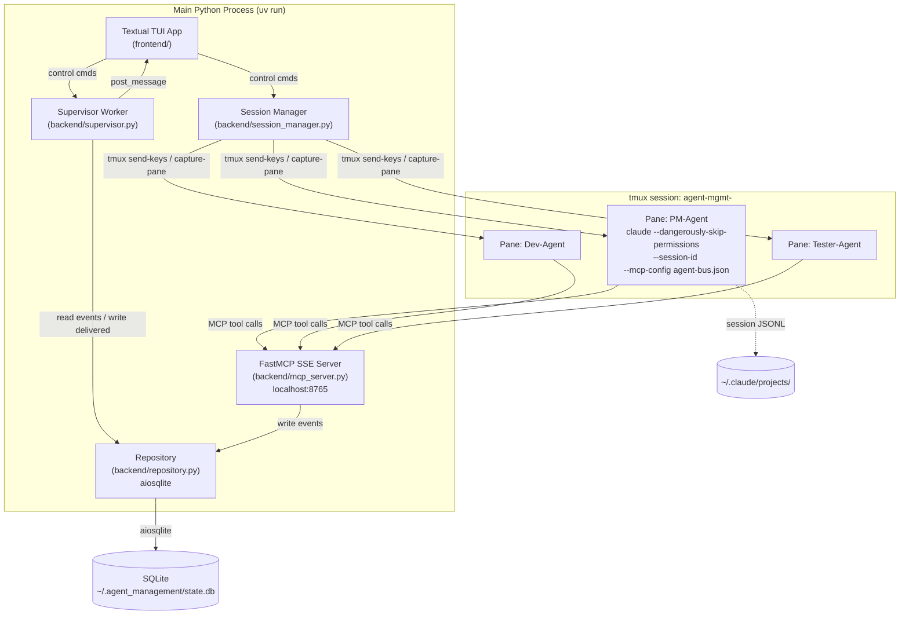
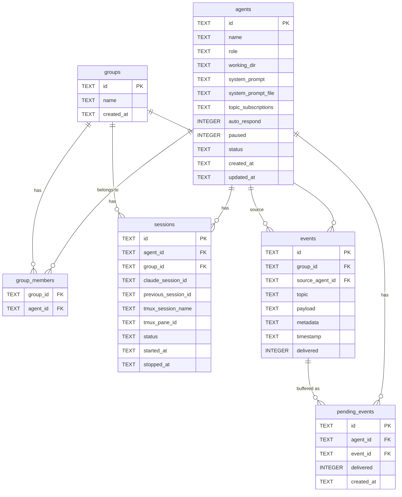
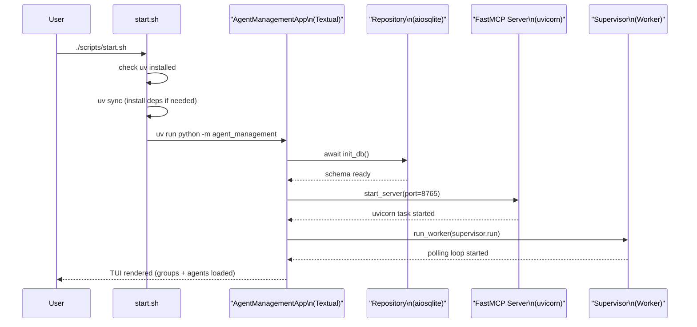
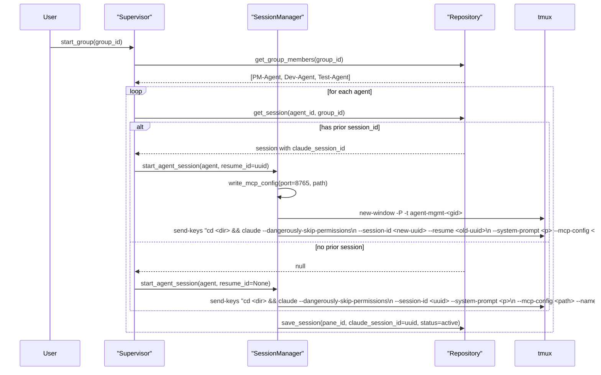
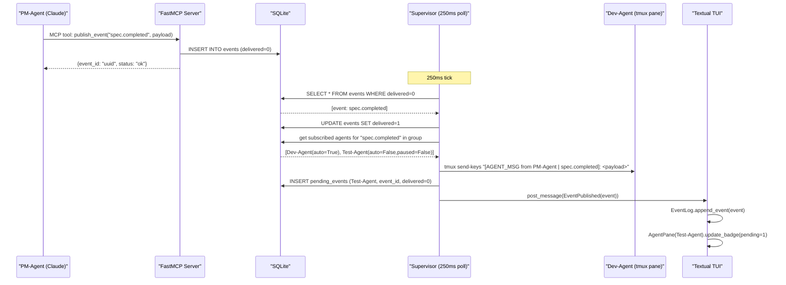

# REQ-001 Technical Design
> Status: Technical Finalized
> Requirement: requirement.md
> Created: 2026-04-07
> Updated: 2026-04-07

## 1. Technology Stack

| Module | Technology | Rationale |
|:---|:---|:---|
| Language | Python 3.13 | asyncio-native, ptyprocess/tmux control, already installed |
| Package manager | `uv` | Fast, reproducible, handles venv creation automatically |
| TUI framework | `textual` ≥ 1.0 | CSS-styled widgets, asyncio-native, Worker API for background tasks |
| MCP server | `mcp[cli]` (FastMCP, SSE transport) | First-class Claude integration; HTTP SSE allows N agents to share one server |
| HTTP server | `uvicorn` (managed by FastMCP) | FastMCP's built-in SSE runner; no manual ASGI setup |
| Database | SQLite via `aiosqlite` | Zero-config, WAL mode, async API, concurrent read/write safe |
| Terminal backend | `tmux` subprocess calls | tmux 3.6a installed; sessions survive TUI crash; send-keys for input injection |
| Claude CLI | `claude --dangerously-skip-permissions` | Equivalent of local `claude_skip` alias; required for agent autonomy |

## 2. Design Principles

- **High cohesion, low coupling**: each module has one responsibility and communicates via typed interfaces (dataclasses + async queues)
- **Shared database as message backbone**: the MCP server writes events; the supervisor reads them directly from SQLite — no inter-process socket needed between them
- **Textual Worker for background tasks**: supervisor and tmux capture-pane polling run as Textual Workers, fully integrated with the TUI event loop via `post_message()`
- **Startup resilience**: `start.sh` checks for `uv`, syncs dependencies, then launches; handles missing venv gracefully

## 3. Architecture Overview


**Figure 3.1 — High-level architecture: all services run in one Python process; SQLite is the shared state backbone**

## 4. Module Design

### 4.1 `backend/models.py` — Data Models
- **Responsibility**: define all shared dataclasses used across backend and frontend
- **Public interface**: `Agent`, `Group`, `GroupMember`, `Session`, `Event`, `PendingEvent` dataclasses; `AgentStatus`, `AgentRole` enums
- **Internal structure**: pure `@dataclass` + `Enum`, no I/O logic
- **Reuse notes**: imported by every other module; the single source of truth for data shapes

### 4.2 `backend/repository.py` — SQLite Repository
- **Responsibility**: all database CRUD operations, schema migrations, WAL setup
- **Public interface**:
  - `async init_db()` — creates tables if not exist, sets WAL mode
  - `async save_agent(agent: Agent)`, `async get_agents()`, `async get_agent(id)`
  - `async save_group(group: Group)`, `async get_groups()`, `async get_group_members(group_id)`
  - `async save_session(session: Session)`, `async get_session(agent_id, group_id)`
  - `async insert_event(event: Event)`, `async get_undelivered_events(group_id)`
  - `async mark_event_delivered(event_id)`, `async insert_pending_event(...)`, `async get_pending_events(agent_id)`
  - `async set_agent_paused(agent_id, paused: bool)`
- **Internal structure**: single `aiosqlite.Connection` held open; all methods are `async`; connection obtained via `async with aiosqlite.connect(DB_PATH)`
- **Reuse notes**: injected into `Supervisor`, `SessionManager`, and `MCPServer`; never instantiated more than once (singleton)

### 4.3 `backend/mcp_server.py` — FastMCP SSE Server
- **Responsibility**: expose 4 MCP tools to Claude agent sessions; store events in SQLite
- **Public interface**:
  - `create_app(repo: Repository) -> FastMCP` — creates the FastMCP server instance
  - `start_server(app: FastMCP, host: str, port: int)` — runs uvicorn in a background asyncio task
- **MCP tools exposed**:
  - `publish_event(topic, payload, source_agent_id, group_id, metadata?)` → stores Event in SQLite
  - `get_pending_events(agent_id, topics)` → returns list of pending events (for agent self-polling, rarely used)
  - `pause_agent(agent_id)` → sets agent.paused=True in SQLite
  - `get_group_status(group_id)` → returns all agents' statuses in a group
- **Internal structure**: `FastMCP("agent-bus")` instance; tools registered via `@mcp.tool()` decorator; `repo` injected via closure
- **Reuse notes**: `create_app()` is the only entry point; `start_server()` spawns a `asyncio.Task`

### 4.4 `backend/session_manager.py` — tmux + Claude CLI Manager
- **Responsibility**: manage tmux sessions and Claude CLI process lifecycle
- **Public interface**:
  - `async start_agent_session(agent: Agent, group_id, session_id, resume_id?, mcp_config_path)` → creates tmux pane, launches `claude --dangerously-skip-permissions`, returns `pane_id`
  - `async stop_agent_session(pane_id)` → graceful stop then kill
  - `async capture_pane_output(pane_id) -> str` → returns last N lines of pane
  - `async send_keys(pane_id, text)` → injects text into tmux pane
  - `async write_mcp_config(port: int, output_path: Path)` → writes per-agent `.mcp.json`
- **Internal structure**: all tmux operations via `asyncio.create_subprocess_exec("tmux", ...)` with stdout capture; long payloads (> 200 chars) written to temp file and injected via `cat /tmp/<uuid>.txt`
- **Reuse notes**: called only by `Supervisor`

### 4.5 `backend/supervisor.py` — Event Bus Supervisor
- **Responsibility**: asyncio polling loop that fans out events from SQLite to agent tmux panes
- **Public interface**:
  - `Supervisor(repo, session_manager)` — constructor
  - `async run()` — main loop: polls undelivered events every 250ms, fans out
  - `async pause_agent(agent_id)`, `async resume_agent(agent_id)` — called by TUI
  - `async start_group(group_id)`, `async stop_group(group_id)`, `async resume_group(group_id)` — session lifecycle
- **Internal structure**:
  - `_fan_out(event)` — for each subscribed non-paused agent: `send_keys()` or buffer
  - `_drain_pending(agent_id)` — send buffered events after resume
  - Runs as a Textual `Worker` (`@work(exclusive=True)`)
  - Posts `AgentStatusChanged`, `EventPublished` messages to Textual app
- **Reuse notes**: the central coordinator; TUI controls it via method calls

### 4.6 `frontend/app.py` — Textual App Root
- **Responsibility**: top-level Textual App; owns layout, mounts workers, routes messages
- **Public interface**: `AgentManagementApp` class; `run()` entry point
- **Internal structure**:
  - `compose()` → `GroupPanel` (header) + `HorizontalScroll` of `AgentPane` × N + `EventLog` (footer)
  - `on_mount()` → `init_db()`, `start_server()`, `self.run_worker(supervisor.run)`
  - Message handlers: `on_agent_status_changed()`, `on_event_published()`, `on_agent_pane_pause()`, `on_agent_pane_resume()`
  - Keyboard bindings: `N` new agent, `G` new group, `S` start group, `Q` quit

### 4.7 `frontend/agent_pane.py` — Agent Terminal Pane Widget
- **Responsibility**: display a single agent's tmux pane output and controls
- **Public interface**: `AgentPane(agent: Agent)` widget
- **Internal structure**:
  - `RichLog` widget showing captured pane output (refreshed by `set_interval(0.25, self._refresh_output)`)
  - Status badge (`Label`) with reactive `status` attribute
  - Pending event count badge
  - `Pause` / `Resume` / `Edit` buttons
  - `on_key()` — captures keystrokes when focused, sends to tmux pane via supervisor

### 4.8 `frontend/event_log.py` — Event Log Widget
- **Responsibility**: real-time display of all pub/sub events in the group
- **Public interface**: `EventLog` widget; `append_event(event: Event)` method
- **Internal structure**: `RichLog` with auto-scroll; called by app message handler

### 4.9 `frontend/group_panel.py` — Group Control Panel
- **Responsibility**: group selector, start/stop/resume controls, group management buttons
- **Public interface**: `GroupPanel` widget
- **Internal structure**: `Select` widget for group selection; `Button` row for actions

### 4.10 `frontend/dialogs.py` — Modal Dialogs
- **Responsibility**: `NewAgentDialog`, `NewGroupDialog`, `EditAgentDialog` modals
- **Public interface**: each dialog extends `ModalScreen`; returns typed result via `dismiss()`
- **Internal structure**: `Input` widgets for fields; inline validation on `Input.Changed`

### 4.11 `shared/config.py` — Platform Configuration
- **Responsibility**: central constants (DB path, MCP port, tmux prefix, temp dir)
- **Public interface**: module-level constants: `DB_PATH`, `MCP_PORT`, `TMUX_SESSION_PREFIX`, `TEMP_DIR`, `CLAUDE_CMD`
- **Note**: `CLAUDE_CMD = ["claude", "--dangerously-skip-permissions"]`

## 5. Data Model


**Figure 5.1 — Entity-Relationship diagram**

## 6. API Design

### 6.1 MCP Tools (agent-bus server, SSE on localhost:8765)

| Tool | Input | Output | Description |
|:---|:---|:---|:---|
| `publish_event` | `topic: str, payload: str, source_agent_id: str, group_id: str, metadata?: dict` | `{event_id: str, status: "ok"}` | Agent publishes a completion event |
| `get_pending_events` | `agent_id: str, topics: list[str]` | `list[Event]` | Poll pending events for this agent |
| `pause_agent` | `agent_id: str` | `{status: "ok"}` | Agent pauses its own event reception |
| `get_group_status` | `group_id: str` | `list[AgentStatus]` | Query all agents' current statuses |

### 6.2 MCP Config File Format (per-agent `.mcp.json`)

```json
{
  "mcpServers": {
    "agent-bus": {
      "type": "sse",
      "url": "http://localhost:8765/sse"
    }
  }
}
```

Written by `SessionManager.write_mcp_config()` to `~/.agent_management/mcp/<agent_id>.json` before session start.

## 7. Key Flows

### 7.1 Platform Startup Sequence


**Figure 7.1 — Platform startup sequence**

### 7.2 Agent Session Start (with Resume)


**Figure 7.2 — Agent session start flow with resume**

### 7.3 Pub/Sub Event Delivery


**Figure 7.3 — Pub/sub event delivery flow**

## 8. Shared Modules & Reuse Strategy

| Module | Used By | Shared Capability |
|:---|:---|:---|
| `backend/models.py` | All modules | Data shapes (Agent, Group, Event, Session dataclasses) |
| `backend/repository.py` | `mcp_server`, `supervisor`, `session_manager`, all `frontend/` | SQLite CRUD — single shared instance |
| `shared/config.py` | All modules | `DB_PATH`, `MCP_PORT`, `CLAUDE_CMD`, `TMUX_SESSION_PREFIX` |

**Instantiation strategy**: `Repository` and `FastMCP` are created once in `app.py` and passed by reference (constructor injection) to all modules that need them. No global singletons.

## 9. Startup Script Strategy

### 9.1 `scripts/start.sh`

```bash
#!/bin/bash
# 1. Check uv
if ! command -v uv &>/dev/null; then
    echo "uv not found. Install: curl -LsSf https://astral.sh/uv/install.sh | sh"
    exit 1
fi
# 2. Sync deps (creates .venv if missing, no-op if up to date)
cd "$(dirname "$0")/.."
uv sync
# 3. Launch
uv run python -m agent_management "$@"
```

### 9.2 `pyproject.toml` entry point

```toml
[project.scripts]
agent-mgmt = "agent_management.__main__:main"
```

## 10. Risks & Notes

| Risk | Mitigation |
|:---|:---|
| FastMCP SSE transport compatibility with Claude Code CLI | Verify at coding time; fallback: use `stdio` transport with a wrapper script per agent |
| tmux `send-keys` input buffer limit (~4KB) | Long payloads written to temp file and sent via `cat` command |
| Textual Worker + asyncio task contention | Supervisor uses `asyncio.sleep(0.25)` yield points; MCP server uses its own uvicorn thread pool |
| Claude session ID assignment via `--session-id` | Flag confirmed in `claude --help`; UUID pre-generated by supervisor before session start |
| `aiosqlite` WAL concurrent writes | WAL mode set at `init_db()`; `PRAGMA journal_mode=WAL` + `PRAGMA synchronous=NORMAL` |

## 11. Change Log

| Version | Date | Changes | Affected Scope | Reason |
|:---|:---|:---|:---|:---|
| v1 | 2026-04-07 | Initial version | ALL | Technical design complete |
