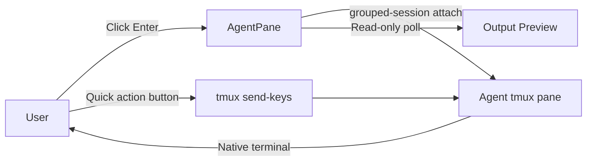
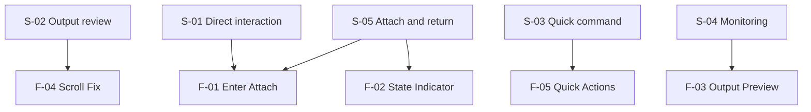
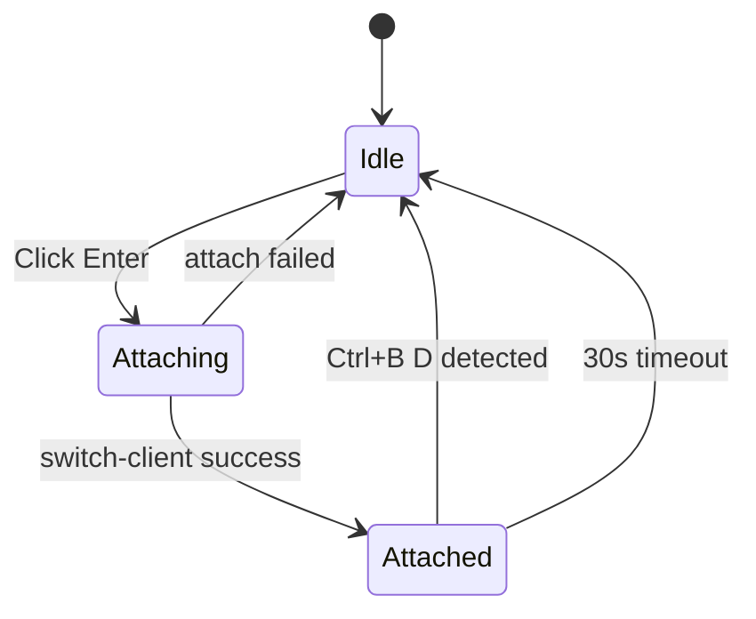
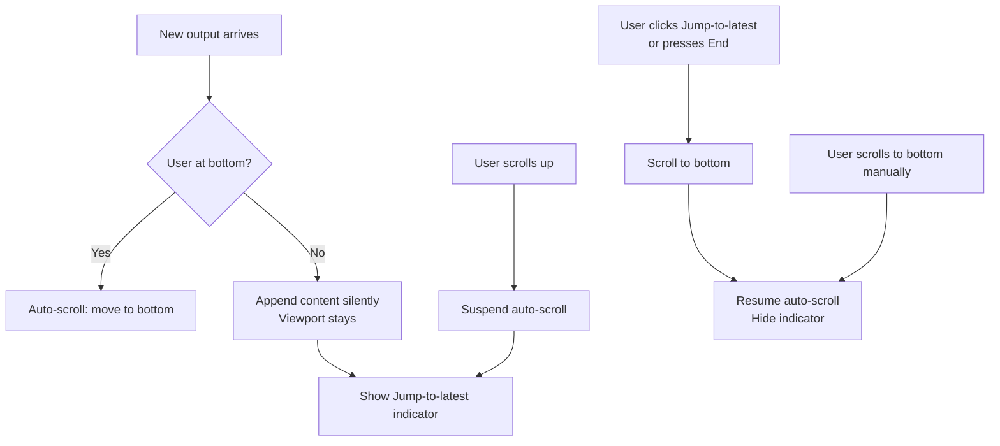

# REQ-013 Terminal Attach Interaction & Output Scroll Fix

> Status: Requirement Finalized
> Created: 2026-04-07
> Updated: 2026-04-07

## 1. Background

### 1.1 Current Interaction Model

The Agent Management Platform displays each agent inside an **AgentPane** widget. The current primary interaction method is a text input box: users type a message and click a send button. This is a "proxy send" model — the TUI acts as an intermediary between the user and the agent's underlying tmux pane.

### 1.2 Why This Is Insufficient

- Native terminal features (arrow keys, Ctrl+C, tab completion, ANSI rendering, interactive prompts) are unavailable through the proxy input
- Claude Code CLI frequently presents interactive dialogs — permission prompts, `[Y/n]` confirmations, selection menus — that require direct stdin access
- Users expect to "talk to the agent" the same way they would open a terminal window directly

### 1.3 Existing Attach Infrastructure

REQ-011 already implemented an **Enter button** on each AgentPane that attaches the user's terminal to the agent's live tmux pane via a grouped tmux session. REQ-012 (currently at "Requirement Finalized", not yet in development) fixes the pane routing bug that causes the Enter button to land on the wrong pane.

### 1.4 Output Scroll Bug

The output preview area in each AgentPane has two related bugs:
- The view auto-scrolls to the bottom every time new content arrives, even if the user has manually scrolled up
- The scrollbar cannot be dragged — it snaps back to the bottom immediately

This makes it impossible to review historical agent output without detaching from the TUI.

### 1.5 Scope of This REQ

This REQ makes the **Enter/Attach path the primary interaction model**, fixes the output scroll bug, and adds lightweight quick-action buttons. The existing text input box is kept intact — its removal is deferred to a future REQ at the user's explicit request.

**Figure 1.1 — Primary interaction flows in REQ-013**

### 1.6 Dependency

> ⚠️ **REQ-012 must be completed and verified before REQ-013 development begins.** The pane routing fix in REQ-012 F-03 is a hard prerequisite for reliable attach behavior.

## 2. Target Users & Scenarios

### 2.1 Primary User

Developer running the Agent Management Platform locally, managing multiple Claude Code CLI agents simultaneously.

### 2.2 Usage Scenarios

| ID | Scenario | Description |
|:---|:---|:---|
| S-01 | Direct interaction | User wants to talk to an agent as in a native terminal — free keyboard input, full ANSI rendering, all shortcuts |
| S-02 | Output review | User wants to scroll back through an agent's output history without being forced to the bottom |
| S-03 | Quick command | User wants to send a common command (e.g. `continue`) without entering full attach mode |
| S-04 | Monitoring | User watches multiple agents' live output simultaneously from the TUI overview |
| S-05 | Attach and return | User attaches to an agent pane, completes interaction, and returns to TUI with Ctrl+B D |

**Figure 2.1 — Scenario to feature mapping**

## 3. Functional Requirements

### 3.1 F-01 Enter Button — Primary Interaction Entry Point

#### 3.1.1 Main Flow

1. Each AgentPane has an **Enter** button prominently displayed in the controls row
2. User clicks Enter → validates that the agent has an active tmux pane (routing provided by REQ-012 F-03)
3. Terminal switches to the agent's tmux pane:
   - **In-tmux path**: creates a grouped tmux session targeting the correct pane, then calls `tmux switch-client`
   - **Out-of-tmux path**: suspends the Textual app and calls `tmux attach-session -t {session}:{pane}`
4. User gets full native terminal interaction: keyboard input, ANSI colors, Ctrl+C, arrow keys, interactive prompts
5. User presses **Ctrl+B D** to detach; TUI resumes; AgentPane restores to its normal state

#### 3.1.2 Error Handling

- Agent has no active pane → toast `"Agent has no active pane — use Start Group"`
- Pane routing validation fails → actionable toast per REQ-012 F-06 message set
- Attach operation fails mid-way → re-enable Enter button; show error toast with reason

#### 3.1.3 Edge Cases

- Multiple AgentPanes are open; each pane's attach state is independent
- Agent's tmux pane is restarted while user is attached → grouped session becomes orphaned; on detach, TUI shows toast `"Agent pane was restarted during attach"`

> **Note**: This feature depends on REQ-012 F-03 being implemented first.

### 3.2 F-02 Attach Mutual Exclusion State Indicator

#### 3.2.1 Main Flow

1. While a terminal is attached to an agent pane, that AgentPane displays a clear visual indicator:
   `⚡ Attached — press Ctrl+B D to return`
2. Enter button is **disabled** for the duration of the active attach session
3. Quick-action buttons (F-05) are also disabled during attach
4. On detach event detected, indicator disappears and Enter button re-enables within 2 seconds

#### 3.2.2 Error Handling

- Detach event not detected within **30 seconds** → force-reset the indicator and re-enable the button
- Multiple rapid Enter clicks before state resolves → button remains disabled; additional clicks are no-ops

#### 3.2.3 Edge Cases

- TUI temporarily loses focus while user is attached → indicator persists; state recovers on next Textual render cycle

**Figure 3.1 — AgentPane attach state machine**

### 3.3 F-03 Output Preview Area (Read-Only Live Stream)

#### 3.3.1 Main Flow

1. Each AgentPane contains a **read-only scrollable output area** (Textual `RichLog` or `ScrollView`)
2. Content is refreshed by polling `tmux capture-pane -p -t {pane_id}` at a configurable interval (default: 500 ms, constant `OUTPUT_POLL_INTERVAL_MS`)
3. Output renders ANSI escape codes (colors, bold, dim) where Textual's widget supports them
4. **Scroll-lock behavior**: auto-scroll to bottom occurs **only if the user's view is already at the bottom**; if the user has scrolled up, new content is added silently without moving the viewport

#### 3.3.2 Error Handling

- `tmux capture-pane` fails (pane gone or tmux not running) → stop polling; append `(agent stopped)` footer to output; do not clear existing content
- Widget content exceeds buffer limit → ring buffer of last `OUTPUT_BUFFER_LINES = 500` lines (configurable constant); oldest lines are dropped silently

#### 3.3.3 Edge Cases

- Agent produces very high output volume (e.g. build log spam) → throttle poll to 1 s; drop intermediate captured frames
- Multiple agents active simultaneously → each AgentPane polls its own pane_id independently; no shared polling loop

### 3.4 F-04 Fix Output Area Scroll — Manual Scroll Must Work

#### 3.4.1 Main Flow

1. User can click and **drag the scrollbar** in the output area to any vertical position
2. User can use **mouse wheel** to scroll freely up and down
3. When the user manually scrolls upward (moves away from the bottom):
   - Auto-scroll is **suspended**
   - A `↓ Jump to latest` indicator appears (inline label or floating button)
4. When the user is **not at the bottom**:
   - New output is appended to the content but the viewport does **not move**
   - The `↓ Jump to latest` indicator remains visible
5. Clicking `↓ Jump to latest` or pressing the **End** key:
   - Jumps viewport to bottom
   - Re-enables auto-scroll
   - Hides the indicator
6. When new output arrives and user is **already at the bottom**: continue auto-scrolling without interruption

#### 3.4.2 Error Handling

- Scroll position calculation returns an invalid value → default viewport to bottom
- Widget resize event fires → recalculate whether viewport is at bottom; preserve relative position if not

#### 3.4.3 Edge Cases

- User scrolls manually back to the very bottom → auto-scroll resumes automatically without requiring a click on the indicator
- TUI window is resized → scroll position recalculated proportionally; `↓ Jump to latest` visibility re-evaluated

**Figure 3.2 — Scroll lock / unlock decision flow**

### 3.5 F-05 Quick Action Buttons

#### 3.5.1 Main Flow

1. Each AgentPane displays a row of **quick-action buttons** in the controls row (default set: `Continue`, `Stop`)
2. Clicking a button sends the corresponding text string to the agent's tmux pane via `tmux send-keys -t {pane_id} "{command}" Enter`
3. Buttons are **enabled only** when:
   - The agent has an active tmux pane
   - The agent is not currently in attach mode (F-02)

#### 3.5.2 Error Handling

- `tmux send-keys` fails (pane gone) → toast `"Could not send command — agent pane not available"`
- Button clicked while attach mode is active → no-op; button is visually disabled (no toast needed)

#### 3.5.3 Edge Cases

- Quick action is sent while agent is still processing a previous response → command is buffered at the tmux input level; no application-level queue is needed
- User customization of button labels or command strings is **out of scope** for this REQ — deferred to a future REQ

## 4. Non-functional Requirements

### 4.1 Configuration Constants

All tuneable values must be named constants in `shared/config.py`:

| Constant | Default | Description |
|:---|:---|:---|
| `OUTPUT_POLL_INTERVAL_MS` | `500` | Output area refresh interval in milliseconds |
| `OUTPUT_BUFFER_LINES` | `500` | Maximum lines kept in the output ring buffer |
| `ATTACH_STATE_TIMEOUT_S` | `30` | Seconds before attach state is force-reset |

### 4.2 State Persistence

- Attach state (attached / idle) must be tracked per-agent in the **existing** agent session data structure
- No new database tables or persistent files are introduced for attach state

### 4.3 Regression Safety

- F-04 scroll fix must not change the behavior of any Textual `RichLog` or `ScrollView` widget used outside of AgentPane output areas
- All existing unit tests in `tests/test_tmux_attach.py` must continue to pass without modification

## 5. Out of Scope

- **Removing the text input box** from AgentPane — deferred to a future REQ at user's explicit request
- **Input history** (Up/Down arrow in text input box) — future REQ
- **Broadcast messages** to multiple agents simultaneously — future REQ
- **Message queue** for busy agents — future REQ
- **Custom quick-action button configuration UI** — future REQ
- **Web UI alternative** — future REQ
- **MCP structured event input** (JSON payload form) — future REQ

## 6. Acceptance Criteria

| ID | Feature | Condition | Expected Result |
|:---|:---|:---|:---|
| AC-01 | F-01 Enter Attach | User clicks Enter on active agent | Terminal switches to agent's tmux pane; full keyboard input works |
| AC-02 | F-01 Enter Attach | User presses Ctrl+B D | Returns to TUI; AgentPane shows normal state |
| AC-03 | F-01 Error | Agent has no active pane | Toast shows actionable message; Enter button re-enables |
| AC-04 | F-02 State Indicator | Attach is active | AgentPane shows `⚡ Attached` indicator; Enter button disabled |
| AC-05 | F-02 State Indicator | User detaches | Indicator disappears; Enter button re-enables within 2 s |
| AC-06 | F-02 Timeout | No detach event for 30 s | Indicator force-resets; Enter button re-enables |
| AC-07 | F-03 Output Preview | Agent is running | Output area updates within 1 s of new content appearing in tmux pane |
| AC-08 | F-03 Output Preview | Agent stops | Output area shows last captured content + `(agent stopped)` footer |
| AC-09 | F-04 Scroll Fix | User drags scrollbar up | Scrollbar moves to dragged position; viewport stays there; auto-scroll suspends |
| AC-10 | F-04 Scroll Fix | User is scrolled up; new output arrives | Viewport does NOT jump to bottom; `↓ Jump to latest` indicator is visible |
| AC-11 | F-04 Scroll Fix | User is at bottom; new output arrives | Viewport auto-scrolls; no interruption; no indicator shown |
| AC-12 | F-04 Jump to latest | User clicks `↓ Jump to latest` | Viewport jumps to bottom; auto-scroll resumes; indicator disappears |
| AC-13 | F-05 Quick Actions | User clicks `Continue` button | String `continue` sent to agent pane; agent receives it |
| AC-14 | F-05 Quick Actions | Attach mode is active | Quick action buttons are visually disabled; clicks are no-ops |

## 7. Change Log

| Version | Date | Changes | Affected Scope | Reason |
|:---|:---|:---|:---|:---|
| v1 | 2026-04-07 | Initial version | ALL | User feedback: need terminal-like interaction; output scroll non-functional |
